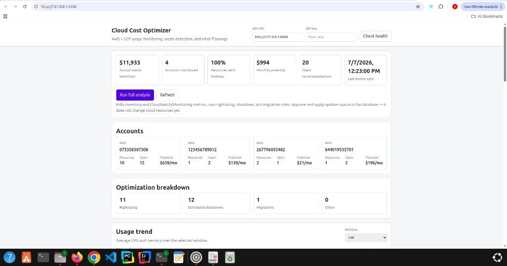

# Real-Time Cloud Cost Optimization Engine

Monitors AWS and GCP compute usage, flags waste with simple rules, and lets you review recommendations before marking them approved or applied.

**Stack:** Python · FastAPI · SQLAlchemy · PostgreSQL · Redis · AWS/GCP APIs · Docker · Terraform



---

## What it does

- Discovers EC2, ECS, and GCE instances from configured AWS profiles and GCP projects
- Pulls CloudWatch / Monitoring metrics on demand or every 15 minutes via the worker
- Runs rules for rightsizing, scheduled shutdowns, idle VMs, and migration candidates
- Shows estimated savings per account in the dashboard
- Supports what-if simulations and an approve → apply workflow with audit logs

Savings numbers come from **utilization heuristics**, not AWS Cost Explorer or GCP billing APIs.

**Apply** only updates status in Postgres. It does not stop or resize cloud resources.

---

## Run with Docker

```bash
git clone https://github.com/aminuiliyasu/Real-Time-Cloud-Cost-Optimization-Engine.git
cd Real-Time-Cloud-Cost-Optimization-Engine
cp .env.example .env
```

Edit `.env`:

```env
API_KEY=your-random-key
POSTGRES_PASSWORD=postgres
AWS_PROFILES=default:af-south-1,rhentify-aws:us-east-1
GCP_PROJECTS=my-project:us-central1-a   # optional
```

Start the stack:

```bash
docker compose up -d --build
```

| Service   | URL |
|-----------|-----|
| Dashboard | http://127.0.0.1:5500 |
| API       | http://127.0.0.1:8000 |
| API docs  | http://127.0.0.1:8000/docs |

Open the dashboard, paste your `API_KEY`, and click **Run full analysis**.

AWS credentials are read from `~/.aws` (mounted in `docker-compose.yml`). For GCP, run `gcloud auth application-default login` or set `GOOGLE_APPLICATION_CREDENTIALS`.

### Database password issues

If the API fails with `password authentication failed`, the Postgres volume was probably created with an old password. Reset it:

```bash
docker compose down -v
docker compose up -d --build
```

Or update the password in the running container:

```bash
docker exec rtcco_postgres psql -U postgres -c "ALTER USER postgres WITH PASSWORD 'postgres';"
docker compose up -d --build
```

---

## Local dev (API outside Docker)

```bash
docker compose up -d postgres redis

cd backend
python -m venv .venv && source .venv/bin/activate
pip install -r requirements.txt
alembic upgrade head
uvicorn app.main:app --reload --port 8000
```

Dashboard in another terminal:

```bash
cd dashboard/src && python3 -m http.server 5500
```

---

## Project layout

```
.
├── backend/           # FastAPI, rules, ingestion, worker
├── dashboard/src/     # Static UI
├── docs/              # Screenshots
├── infra/terraform/   # AWS VPC + EC2 host
├── .github/workflows/ # CI
└── docker-compose.yml
```

---

## API endpoints

| Method | Path | Notes |
|--------|------|-------|
| GET | `/health` | Health check |
| GET | `/dashboard/portfolio` | Account summary |
| GET | `/dashboard/kpis` | Counts and savings totals |
| GET | `/dashboard/trends?hours=24` | Chart data |
| GET | `/recommendations` | List recommendations |
| POST | `/recommendations/{id}/simulate` | What-if run |
| POST | `/recommendations/{id}/approve` | Needs `X-API-Key` + `X-Role: operator` |
| POST | `/recommendations/{id}/execute` | Needs `X-API-Key` + `X-Role: admin` |
| POST | `/dev/pipeline/run-full-analysis` | Dev only — ingest + rules |

Dev endpoints require `APP_ENV=development`, `X-API-Key`, and `X-Role: admin`.

---

## Rules

| Rule | Trigger | Suggested action |
|------|---------|------------------|
| `idle_vm` | EC2/GCE avg CPU < 5% | Rightsize |
| `ecs_underutilized_service` | ECS CPU < 20% and memory < 30% | Rightsize tasks |
| `scheduled_shutdown` | EC2/GCE avg CPU < 8% | Schedule shutdown |
| `migration_candidate` | EC2/GCE CPU between 5–15% | Smaller instance type |

---

## Background worker

Included in Docker Compose. To run manually:

```bash
cd backend
python -m app.workers.scheduler --run-once --hours 24
python -m app.workers.scheduler --hours 24 --interval-seconds 900
```

---

## Terraform

Minimal AWS setup: VPC, security group, EC2 with Docker, IAM read-only role for FinOps API calls.

```bash
cd infra/terraform
cp terraform.tfvars.example terraform.tfvars
terraform init && terraform apply
```

SSH to the instance, clone the repo, copy `.env`, then run `docker compose up -d --build`.

---

## Tests

```bash
cd backend && source .venv/bin/activate
pytest -q
```

CI runs on push/PR to `main` via GitHub Actions.

---

## Author

**Aminu Iliyasu** — [GitHub](https://github.com/aminuiliyasu)
